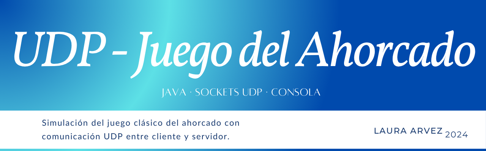

# 🕹️ UDP - Juego del Ahorcado

Este proyecto es una implementación del clásico **juego del ahorcado**, donde el cliente y el servidor se comunican mediante el **protocolo UDP (User Datagram Protocol)**. Está desarrollado como práctica de programación en red.

---

## 🎯 Objetivo

Simular un juego interactivo del ahorcado con comunicación en red utilizando UDP en lugar de TCP, lo que implica gestión manual de paquetes y mayor control del flujo.

---

## 🛠️ Tecnologías utilizadas

- 💻 **Lenguaje:** Java  
- 📡 **Protocolo:** UDP (Sockets en Java)
- 🧪 **Entorno:** Local, consola

---

## 🧱 Estructura del proyecto
udp-juego-ahorcado/
┣ Cliente/
┗ Servidor/


- **Servidor:** Escucha palabras, controla los intentos, envía mensajes de resultado.
- **Cliente:** Solicita palabra, envía letras, recibe estado actual del juego.

---

## 🚀 Cómo ejecutar

> Asegúrate de compilar y ejecutar en dos terminales separadas: una para el servidor y otra para el cliente.

```bash
# Compilar
javac Servidor/Servidor.java
javac Cliente/Cliente.java

# Ejecutar
java Servidor.Servidor
java Cliente.Cliente

📝 Notas

No incluye interfaz gráfica: se ejecuta completamente por consola.
Interfaz gráfica > próximamente 
